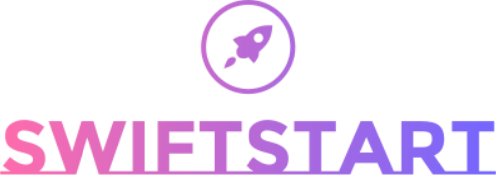

<div align="center"><a href="https://github.com/devbytemehedi/swiftstart.git"></a></div>
<div align="center">
 <h3><strong>A versatile web project starter template with HTML5, CSS3, Tailwind CSS, daisyUI, Git, and Node.js for quick, responsive web development.</strong></h3>
</div>
<div align="center"><a href="https://devbytemehedi.github.io/swiftstart"> </a> <a href="https://swiftstart.netlify.app"></a></div>

## Features

- Responsive
- Good Folder Structure
- Good Documentation
- MIT License

## OS, Terminal & Shell
   

## Software Used
   

## Technology Used
      

## Connect with me
[](https://github.com/devbytemehedi) [](https://www.linkedin.com/in/devbytemehedi/) [](https://facebook.com/iamrealmehedi) [](https://dev.to/devbytemehedi) [](https://codepen.io/devbytemehedi)


## Folder Structure

```scss
swiftstart
 ┣ .vscode
 ┃ ┗ settings.json
 ┣ src
 ┃ ┣ assets
 ┃ ┃ ┣ data
 ┃ ┃ ┃ ┗ BrandBoard.pdf
 ┃ ┃ ┣ favicons
 ┃ ┃ ┃ ┣ swiftstart-website-favicon-color.png
 ┃ ┃ ┃ ┗ swiftstart-website-favicon-color.svg
 ┃ ┃ ┣ fonts
 ┃ ┃ ┃ ┗ Montserrat Subrayada Bold.ttf
 ┃ ┃ ┣ icons
 ┃ ┃ ┣ images
 ┃ ┃ ┗ logo
 ┃ ┃ ┃ ┣ logo-black.png
 ┃ ┃ ┃ ┣ logo-black.svg
 ┃ ┃ ┃ ┣ logo-color.png
 ┃ ┃ ┃ ┣ logo-color.svg
 ┃ ┃ ┃ ┣ logo-no-background.png
 ┃ ┃ ┃ ┣ logo-no-background.svg
 ┃ ┃ ┃ ┣ logo-white.png
 ┃ ┃ ┃ ┣ logo-white.svg
 ┃ ┃ ┃ ┣ swiftstart-high-resolution-color-logo.svg
 ┃ ┃ ┃ ┗ swiftstart-high-resolution-logo-color-on-transparent-background.svg
 ┃ ┗ index.css
 ┣ .gitignore
 ┣ 404.html
 ┣ gitattributes.txt
 ┣ index.html
 ┣ LICENSE
 ┣ package.json
 ┣ README.md
 ┣ robots.txt
 ┗ tailwind.config.js


```
## License

The code is available under the [MIT](./LICENSE) license.
