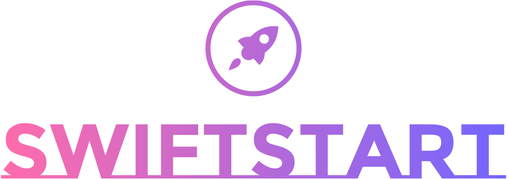

[](https://dub.sh/swiftstart)

<h3 align="center">A tailwind project starter template.</h3>

## How to run this ?

👉 Clone this repository in your **local machine**

👉 Open the cloned project in **`vscode`**

👉 Install packages in **`package.json`**

```bash
npm i
```

👉 Build the project

```bash
npm run build
```

- Install **Live Server Extension**
- Open `src/index.html` and Right click on the editor
- Click **Open with Live Server**.
- Project should be up and running in your browser.

## Folder Structure

```scss
swiftstart
 ├─ .vscode
 │ └─ settings.json
 ├─ dist
 │ └─ .gitkeep
 ├─ src
 │ ├─ assets
 │ │ ├─ favicons
 │ │ │ ├─ icon.png
 │ │ │ └─ icon.svg
 │ │ └─ logo
 │ │ │ ├─ logo-black.png
 │ │ │ ├─ logo-color.png
 │ │ │ ├─ logo-no-bg.png
 │ │ │ └─ logo-white.png
 │ ├─ js
 │ │ └─ index.js
 │ ├─ pages
 │ │ └─ .gitkeep
 │ ├─ index.html
 │ └─ input.css
 ├─ .gitattributes
 ├─ .gitignore
 ├─ index.html
 ├─ LICENSE
 ├─ package.json
 ├─ README.md
 ├─ robots.txt
 └─ tailwind.config.js
```

## License

The code is available under the [MIT](./LICENSE) license.

## Acknowledgements

[Logo.com](https://logo.com/) - [Favicon.io](https://favicon.io/) - [Icons8](https://icons8.com/) - [HTML5 Boilerplate](https://html5boilerplate.com/) - [Tailwind boilerplate](https://github.com/learnwithsumit/tailwind-playlist/tree/lesson-2)
